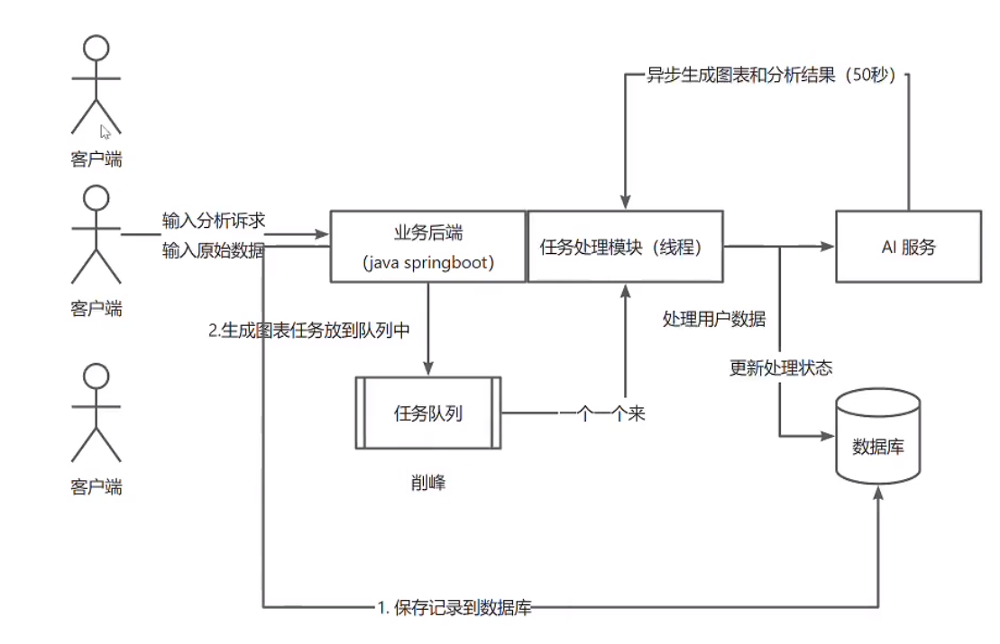

# 数据存储问题与解决方案

## 存在问题

1. **数据存储问题**：这里是将每个图表的原始数据存储到了同一个数据表中的 `chartData` 字段，如果用户上传的原始数据很大，图表日益增多，会导致数据库存储的数据量过大，会导致数据库性能下降，甚至数据库崩溃。

2. **查询性能问题**：用户有查询原始数据的需求，现在如果把所有数据存在一个表的字段中，那么每次都会取出全部数据，性能比较低。

## 解决方案：分库分表

### 方案类型
- **水平分库**、**垂直分表**

### 方案描述
将每个图表数据存储到单独的表中，用户查询的时候，根据图表 id 查询对应的数据，使用 MongoDB。

### 优点
1. 存储时分开，互不影响，也能增加安全性
2. 查询时，可以根据各种 SQL 语句灵活取用需要的字段，性能更高

### 实现方式

#### 方式一：MongoDB

创建一个 MongoDB 数据库，创建一个 collection，将每个图表的数据存储到这个 collection 中，根据图表 id 查询数据

#### 方式二：MySQL
使用 MySQL，创建一个表，将每个图表的数据存储到这个表中，根据图表 id 查询数据，表名设置为 `chart_图表id`

# 限流算法

## 现存问题
使用系统是有消耗成本的，用户有可能疯狂刷量，让你破产

## 解决方案
1. 限制用户调用总次数，控制成本
2. 用户在短时间内疯狂使用，导致服务器资源被占满，其他用户无法使用 → 限流算法

## 核心问题
限流阈值多大比较合适？比如限制单个用户在每秒只能使用1次

## 限流算法类型

### 1. 固定窗口限流
- **原理**：单位时间内允许部分操作，1小时只允许10个用户操作
- **优点**：实现最简单
- **缺点**：可能出现流量突刺。比如前59分钟内，用户访问量只有1个，但是第60分钟的用户访问量却有10个，那么就会导致用户访问量暴增，导致服务器压力过大，用户访问失败，服务器仍然有高峰。

### 2. 滑动窗口限流
- **原理**：在时间区间内平滑控制请求次数
- **优点**：不会出现流量突刺，1个小时的时间段内只能访问10个请求
- **缺点**：相对复杂，限流效果和滑动单位有关，滑动单位越小，限流效果越高，但是往往很难选到一个最合适的滑动单位

### 3. 漏桶限流
- **原理**：以固定的速度处理请求，当请求桶满了后拒绝请求。每秒处理10个请求，桶的容量是10，每0.1秒处理1个请求，如果10秒内只有10个请求，那么都能处理，如果是11个，桶就会溢出，那么最后一个会被拒绝
- **优点**：能够一定程度上应对流量突刺
- **缺点**：没办法迅速处理一批请求，只能一个一个按顺序来处理（固定速率的缺点）

### 4. 令牌桶限流
- **原理**：管理员先生产一批令牌，每秒生成10个；当用户要操作时，先去拿到一个令牌，有令牌的就有资格去操作，能够同时执行操作；拿不到令牌就等待
- **优点**：能并发处理同时的请求，并发性能高
- **缺点**：还是存在时间单位选取问题，时间单位小了，

## 限流的粒度
1. 针对某个方法限流，即单位时间内最多允许同时XX个操作使用这个方法
2. 针对某个限流，比如单个用户单位时间内最多执行XX次操作

## 限流实现方式

### 1. 本地限流（单机限流）
每个服务器单独限流，一般适用于单体项目，就是你的项目只有一个服务器

### 2. 分布式限流（多机限流）
- Redisson集中统计用户频率数据限流
- 网关集中限流和统计（Sentinel、Spring Cloud Gateway）

# 异步化

## 概念对比

- **同步**：做完一件事后再去做另外一件事
- **异步**：不用等一件事做完，就可以做另外一件事，比如将热水器打开烧水，设置100度会发出通知提醒，然后去做另外一件事，烧水时人可以同时处理别的事，水烧好后，人能收到通知，就知道水烧好了。

## 业务流程分析

### 标准异步化的业务流程
1. 当用户要进行耗时很长的操作时，用户点击分析后，不需要在界面傻等，而是应该将这个任务保存到数据库中记录下来

2. 用户要执行新任务时：
   - **提交任务成功**：
     - 如果我们的程序还有多余的空闲线程，可以立即去做这个任务
     - 如果我们的程序都在忙，那就放到等待队列中
   - **提交任务失败**：任务队列满了
     - 拒绝这个任务，再也不执行
     - 通过保存到数据库中的记录来看到提交失败的任务，并且在程序闲的时候，可以把任务从数据库中取到程序中，再去执行

3. 我们的程序（线程）从任务队列中取出任务依次执行，完成每一件事要修改一下任务的状态

4. 用户可以查询任务的状态，或者在任务执行成功或者失败时能得到通知

5. 如果要执行的任务很复杂，包含很多环节，每一个小任务完成时，要在程序（数据库）中记录一下任务的执行状态，进度

## 系统的业务流程

1. 用户点击分析时按钮时，先把图表立刻保存到数据库中（作为一个任务）
2. 用户可以在图表管理页面查看所有图表（已生成的、生成中的、生成失败）的信息和状态
3. 用户可以修改生成失败的图表信息，点击重新生成



## 线程池

### 线程池的实现

```java
public ThreadPoolExecutor(
        int corePoolSize,
        int maximumPoolSize,
        long keepAliveTime,
        TimeUnit unit,
        BlockingQueue<Runnable> workQueue,
        ThreadFactory threadFactory,
        RejectedExecutionHandler handler
)
```

#### 参数说明

1. corePoolSize(核心线程数=>相当于正式员工)：正常情况下，我们的系统应该能同时工作的线程数（随时就绪状态）
2. maximumPoolSize(最大线程数=>哪怕任务再多，也只招这些人)：极限情况下，我们的线程池最多有多少个线程
3. keepAliveTime(空闲线程存活时间)：超过这个时间，多余的线程就会自动结束工作，从而释放无用的线程资源
4. TimeUnit unit(空闲线程存活时间的单位)：秒、分
5. workQueue(工作队列)：用于存放给线程执行的任务，存在一个队列的长度（一定要设置一个长度，不要说队列长度无限，因为也会占用资源）
6. threadFactory(线程工厂)：控制每个线程的生成、线程的属性（比如线程名）
7. rejectedExecutionHandler(拒绝策略)：当任务队列满时，我们采取什么措施，比如抛异常、不抛异常、自定义策略

#### 资源隔离策略
- 比如重要的任务一个队列，非重要的任务一个队列，保证这两个队列互不干扰（VIP任务、普通任务）

### 线程池参数设置

当前AI的API处理能力为4QPS，每个任务处理时间为10秒，那么线程池的参数设置如下：

| 参数 | 值 | 说明 |
|------|----|------|
| corePoolSize | 4 | 正常情况下可以设置为4 |
| maximumPoolSize | ≤4 | 考虑极限情况，不超过4 |
| keepAliveTime | 秒级或分钟级 | 多余线程的存活时间 |
| TimeUnit | TimeUnit.SECONDS | 时间单位设置为秒 |
| workQueue | 20 | 结合实际情况设置队列长度 |
| threadFactory | 自定义 | 控制线程的生成和属性（如线程名） |
| rejectedExecutionHandler | 自定义策略 | 抛异常并标记数据库任务状态为"任务满了，已拒绝" |

一般情况下，任务分为IO密集型和计算密集型两种。
- IO密集型：吃带宽、硬盘、内存的读写资源，corePoolSize可以设置大一点，一般经验值是2n左右，建议以IO的能力为主
- 计算密集型：吃CPU资源，比如音视频处理、图像处理、数学计算等，corePoolSize为CPU核数+1（空余线程），可以让每个线程都能利用好CPU的每个核，而且线程之间不用频繁切换（减少打架、开销）
- 混合型：既吃CPU又吃IO，比如爬虫、日志处理、数据库查询、网络请求等，可以设置corePoolSize为CPU核数，然后设置workQueue为有界队列，防止任务过多导致OOM

### 实现工作流程
1. 给chart表中增加任务状态字段（比如排队中、执行中、已完成、失败），任务执行信息字段（用于记录任务执行中、或者执行失败时，保存错误信息）
2. 用户可以在图表管理页面查看所有图表（已生成的、生成中的、生成失败）的信息和状态
3. 任务：先修改图表任务状态为“执行中”，等执行成功后修改为“已完成”、保存执行结果，执行失败时修改为“失败”，记录任务失败信息
4. 用户可以在图表管理页面查看所有图表（已生成、生成中、生成失败）的信息和状态

### 库表设计
```sql
status  varchar(128) not null default 'wait' comment 'wait,running,succeed,failed',
add execMessage text null comment '执行信息';
```


### 进一步优化
1. 增加重试功能（使用guava的Retrying重试）
2. 考虑到AI生成脏数据的情况，在后端进行异常处理
3. 如果任务没进入队列中（或者任务队列满了），可以用定时任务把他放到队列中（补偿）
4. 给任务增加超时时间，超时自动设置为失败
5. 反向压力：通过第三方调用的服务状态来选择系统当前的策略，比如根据AI服务的当前任务队列数来控制自己系统的核心线程数，从而最大化利用资源
6. 我的图表页面增加一个刷新、定时自动刷新的按钮，保证获取到图表的最新状态（前端轮询）
7. 任务执行成功或者失败，给用户发送消息通知（实时：websocket、server sid event）

## RabbitMQ入门

### 基本概念
#### AMQP协议
高级消息队列协议，基于发布/订阅模式，支持点对点、广播、路由、延迟消息、DLQ（死信队列）等
1. 生产者：消息的生成者，发送消息到交换机
2. 消费者：消息的消费者，从队列中获取消息并消费
3. 交换机(Exchange)：消息的交换者，将消息发送到对应的队列
4. 队列(Queue)：消息的存储容器，消息被发送到队列，然后被消费者获取并消费
5. 路由(Routes)：转发，就是怎么把消息从一个地方转到另一个地方(比如从生产者转发到某个队列)

#### 安装
- [RabbitMQ的Windows安装](https://www.rabbitmq.com/docs/install-windows)

- 先安装 Erlang ：[Erlang26.2.5.9的Windows安装](https://erlang.org/download/otp_versions_tree.html)这个语言的性能非常高

- 安装RabbitMQ监控面板：`rabbitmq-plugins.bat enable rabbitmq_shovel rabbitmq_management`进入安装位置sbin下cmd执行
- http://localhost:15672
  默认用户名/密码: guest/guest
- 创建用户：`rabbitmqctl.bat add_user admin admin`，远程服务器部署访问RabbitMQ需要创建用户才能访问
- RabbitMQ端口占用：
- 4369：RabbitMQ集群管理端口
- 5672：RabbitMQ默认端口，用于客户端连接
- 5671：RabbitMQ SSL端口，用于客户端连接
- 15672：RabbitMQ管理端口，用于管理界面访问

### 单向发送
`Hello World`
#### [Java版文档地址](https://www.rabbitmq.com/tutorials/tutorial-one-java)
1. 一个生产者给一个消费者发消息
   - 引用方式： [in the central Maven repository](https://mvnrepository.com/artifact/com.rabbitmq/amqp-client)
    ```xml
    <dependency>
      <groupId>com.rabbitmq</groupId>
      <artifactId>amqp-client</artifactId>
      <version>5.20.0</version>
    </dependency>
    ```
2. 发送消息send
    ```java
    public class SingleProducer {
    
        private final static String QUEUE_NAME = "hello";
    
        public static void main(String[] argv) throws Exception {
            ConnectionFactory factory = new ConnectionFactory();
            factory.setHost("localhost");
            try (Connection connection = factory.newConnection();
                 Channel channel = connection.createChannel()) {
                channel.queueDeclare(QUEUE_NAME, false, false, false, null);
                String message = "Hello World!";
                channel.basicPublish("", QUEUE_NAME, null, message.getBytes());
                System.out.println(" [x] Sent '" + message + "'");
    
            }
    
        }
    }
    ```
#### channel.queueDeclare（可重复声明，但是必须保持一致）
1. durable (boolean类型，第1个false)：队列持久化标志（注意：同名称的消息队列，只能用同样的参数创建一次）
   - false：队列不持久化，RabbitMQ重启后队列会丢失
   - true：队列持久化，RabbitMQ重启后队列仍然存在
2. exclusive (boolean类型，第2个false)：独占性标志
   - false：队列可以被多个连接访问
   - true：队列仅对当前连接可见，连接断开时队列自动删除
3. autoDelete (boolean类型，第3个false)：自动删除标志
   - false：即使没有消费者，队列也不会自动删除
   - true：当最后一个消费者取消订阅后，队列自动删除
4. arguments (Map<String, Object>类型，null)：队列的其他参数配置
   - null：不设置额外参数 ，可用于设置队列的TTL、最大长度等高级特性

### 多消费者(订阅)

#### 场景：多个机器同时去接受并处理
- 消息持久化，指定MessageProperties.PERSISTENT_TEXT_PLAIN参数
    ```java
    channel.basicPublish("", TASK_QUEUE_NAME,
                            MessageProperties.PERSISTENT_TEXT_PLAIN,
                            message.getBytes("UTF-8"));
    ```
#### 生产者：
- 使用Scanner持续接受用户输入，测试更方便
    ```java
    public class MultiProducer {
    
        private static final String TASK_QUEUE_NAME = "multi_queue";
    
        public static void main(String[] argv) throws Exception {
            ConnectionFactory factory = new ConnectionFactory();
            factory.setHost("localhost");
            try (Connection connection = factory.newConnection();
                 Channel channel = connection.createChannel()) {
                channel.queueDeclare(TASK_QUEUE_NAME, true, false, false, null);
    
                Scanner scanner = new Scanner(System.in);
                while (scanner.hasNext()) {
                    String message = scanner.nextLine();
    
                    channel.basicPublish("", TASK_QUEUE_NAME,
                            MessageProperties.PERSISTENT_TEXT_PLAIN,
                            message.getBytes("UTF-8"));
                    System.out.println(" [x] Sent '" + message + "'");
                }
    
            }
        }
    
    }
    ```

#### 消费者：
- 创建多个消费者，并分别监听同一个队列，测试更方便
- 消息确认机制：channel.basicConsume()方法用于启动消费者监听队列
  - 参数说明：
    - TASK_QUEUE_NAME：要监听的队列名称
    - false：设置为手动确认模式，处理完消息后需要手动发送确认，一般都设置为手动确认
    - deliverCallback：消息处理回调函数，定义收到消息后的处理逻辑
    - consumerTag -> {}：消费者取消时的回调函数（这里为空实现）
- channel.basicAck(delivery.getEnvelope().getDeliveryTag(), false);
  - basicAck方法向RabbitMQ服务器发送确认信号
  - delivery.getEnvelope().getDeliveryTag()获取当前消息的唯一标识
  - 第二个参数false表示只确认当前这一条消息
- channel.basicNack(delivery.getEnvelope().getDeliveryTag(), false, false);
  - 拒绝并重新入队消息,并设置重新入队参数为 true，使消息重新放回队列等待其他消费者处理
  - 第二个参数 false: 表示是否批量处理多个消息。设为false表示只处理当前这一条消息，不进行批量操作
  - 第三个参数 false: 表示消息被否定后是否重新入队。设为false表示拒绝的消息不会重新放回队列，通常会被丢弃或进入死信队列
- channel.basicReject(delivery.getEnvelope().getDeliveryTag(), false);
  - 用于拒绝当前消息
  - 第一个参数是消息的唯一标识
  - 第二个参数false表示不重新入队,即丢弃该消息或将其发送到死信队列（如有配置）
    ```java
    public class MultiConsumer {
    
      private static final String TASK_QUEUE_NAME = "multi_queue";
    
      public static void main(String[] argv) throws Exception {
          ConnectionFactory factory = new ConnectionFactory();
          factory.setHost("localhost");
          final Connection connection = factory.newConnection();
    
          for (int i = 0; i < 2; i++) {
              final Channel channel = connection.createChannel();
              channel.queueDeclare(TASK_QUEUE_NAME, true, false, false, null);
              System.out.println(" [*] Waiting for messages. To exit press CTRL+C");
    
              // 控制单个消费者的处理任务 积压 数，每个消费者最多处理1个任务
              channel.basicQos(1);
    
              int finalI = i;
              // 定义了如何处理消息
              DeliverCallback deliverCallback = (consumerTag, delivery) -> {
                  String message = new String(delivery.getBody(), "UTF-8");
    
                  try {
                      // 处理工作
                      System.out.println(" [x] Received '" + "编号" + finalI + ": " + message + "'");
    
                      // 停20秒，模拟机器处理能力有限
                      Thread.sleep(20000);
                      // 指定确认消息
                      channel.basicAck(delivery.getEnvelope().getDeliveryTag(), false);
                  } catch (InterruptedException e) {
                      e.printStackTrace();
                      channel.basicNack(delivery.getEnvelope().getDeliveryTag(), false, false);
                  } finally {
                      System.out.println(" [x] Done");
                      channel.basicAck(delivery.getEnvelope().getDeliveryTag(), false);
                  }
              };
              // 开启消费监听
              channel.basicConsume(TASK_QUEUE_NAME, false, deliverCallback, consumerTag -> {
              });
          }
      }
    }
    ```

### 交换机
#### 场景：多个机器同时去接受并处理任务（尤其是每个机器的处理能力有限）
- 一个生产者给多个队列发消息了，多个消费者从这个队列取消息，1个生产者对多个队列
- 交换机的作用：提供消息转发功能，类似于网络路由器
- 要解决的问题：怎么把消息转发到不同的队列上，好让消费者从不同的队列消费
- 绑定：交换机和队列关联起来，也可以叫路由，算是一个算法或者策略
- 四种类别交换机：direct, topic, headers, fanout
  - fanout: 扇出、广播
    - 特点：消息会被转发到所有绑定到该交换机的队列
    - 场景：很适用于发布订阅的场景，比如写日志，可以多个系统间共享
    - 绑定代码：`channel1.queueBind(queueName1, EXCHANGE_NAME, "绑定规则");`
    - 生产者：
        ```java
        public class FanoutProducer {
        private static final String EXCHANGE_NAME = "fanout-exchange";
        
            public static void main(String[] argv) throws Exception {
                ConnectionFactory factory = new ConnectionFactory();
                factory.setHost("localhost");
        
                try (Connection connection = factory.newConnection();
                     Channel channel = connection.createChannel()
                ) {
                    // 创建一个fanout类型的交换机
                    channel.exchangeDeclare(EXCHANGE_NAME, "fanout");
        
                    Scanner scanner = new Scanner(System.in);
                    while (scanner.hasNext()) {
                        String message = scanner.nextLine();
        
                        channel.basicPublish(EXCHANGE_NAME, "", null,
                                message.getBytes("UTF-8"));
                        System.out.println(" [x] Sent '" + message + "'");
                    }
        
                }
            }
        }
        ```
    - 消费者：
        ```java
        public class FanoutConsumer {
          private static final String EXCHANGE_NAME = "fanout-exchange";
        
          public static void main(String[] argv) throws Exception {
            ConnectionFactory factory = new ConnectionFactory();
            factory.setHost("localhost");
            Connection connection = factory.newConnection();
            Channel channel1 = connection.createChannel();
            Channel channel2 = connection.createChannel();
        
            // 创建交换机
            channel1.exchangeDeclare(EXCHANGE_NAME, "fanout");
            // 创建队列,随机分配一个队列名称
        //    String queueName = channel.queueDeclare().getQueue();
            String queueName1 = "小王的工作队列";
            channel1.queueDeclare(queueName1, false, false, false, null);
            channel1.queueBind(queueName1, EXCHANGE_NAME, "");
        
            String queueName2 = "小李的工作队列";
            channel2.queueDeclare(queueName2, false, false, false, null);
            channel2.queueBind(queueName2, EXCHANGE_NAME, "");
        
            System.out.println(" [*] Waiting for messages. To exit press CTRL+C");
        
            DeliverCallback deliverCallback1 = (consumerTag, delivery) -> {
                String message = new String(delivery.getBody(), "UTF-8");
                System.out.println(" [小王] Received '" + message + "'");
            };
        
            DeliverCallback deliverCallback2 = (consumerTag, delivery) -> {
                String message = new String(delivery.getBody(), "UTF-8");
                System.out.println(" [小李] Received '" + message + "'");
            };
            channel1.basicConsume(queueName1, true, deliverCallback1, consumerTag -> { });
            channel2.basicConsume(queueName2, true, deliverCallback2, consumerTag -> { });
          }
        }
        ```
  - direct：可以让交换机和队列进行关联，可以指定让交换机把什么样的消息发送给那个队列
    - routingKey：路由键，绑定规则，可以理解为消息携带的key，消息根据key去发送给对应的队列
    - 特点：消息会根据路由键转发给特定的队列
    - 场景：特定的消息转发给特定的系统或程序
    - 生产者：
        ```java
        public class DirectProducer {
        
          private static final String EXCHANGE_NAME = "direct_exchange";
        
          public static void main(String[] argv) throws Exception {
            ConnectionFactory factory = new ConnectionFactory();
            factory.setHost("localhost");
            try (Connection connection = factory.newConnection();
                 Channel channel = connection.createChannel()) {
                channel.exchangeDeclare(EXCHANGE_NAME, "direct");
        
                Scanner scanner = new Scanner(System.in);
                while (scanner.hasNext()){
                    String userInput = scanner.nextLine();
                    String[] strings = userInput.split(" ");
                    if (strings.length < 1){
                        continue;
                    }
                    String message = strings[0];
                    String routingKey = strings[1];
        
                    channel.basicPublish(EXCHANGE_NAME, routingKey, null, message.getBytes("UTF-8"));
                    System.out.println(" [x] Sent '" + message + " with routing" + routingKey + "'");
                }
        
            }
          }
        }
        ```
    - 消费者：
        ```java
        public class DirectConsumer {
        
          private static final String EXCHANGE_NAME = "direct_exchange";
        
          public static void main(String[] argv) throws Exception {
            ConnectionFactory factory = new ConnectionFactory();
            factory.setHost("localhost");
            Connection connection = factory.newConnection();
            Channel channel = connection.createChannel();
        
            // 创建交换机
            channel.exchangeDeclare(EXCHANGE_NAME, "direct");
        
            String queueName1 = "小网";
            channel.queueDeclare(queueName1, false, false, false, null);
            channel.queueBind(queueName1, EXCHANGE_NAME,"xiaow");
        
            String queueName2 = "小皮";
            channel.queueDeclare(queueName2, false, false, false, null);
            channel.queueBind(queueName2, EXCHANGE_NAME,"xiaop");
        
        
            System.out.println(" [*] Waiting for messages. To exit press CTRL+C");
        
            DeliverCallback xiaowdeliverCallback = (consumerTag, delivery) -> {
                String message = new String(delivery.getBody(), "UTF-8");
                System.out.println(" [小网] Received '" +
                    delivery.getEnvelope().getRoutingKey() + "':'" + message + "'");
            };
        
            DeliverCallback xiaopdeliverCallback = (consumerTag, delivery) -> {
                String message = new String(delivery.getBody(), "UTF-8");
                System.out.println(" [小皮] Received '" +
                    delivery.getEnvelope().getRoutingKey() + "':'" + message + "'");
            };
        
            channel.basicConsume(queueName1, true, xiaowdeliverCallback, consumerTag -> { });
            channel.basicConsume(queueName2, true, xiaopdeliverCallback, consumerTag -> { });
          }
        }
        ```
  - topic：通配符模式，消息会根据一个模糊路由键转发到指定队列
    - 场景：特定的一类消息可以交给特定的一类系统或程序来处理
    - 绑定关系：可以模糊匹配多个绑定
      - *.：匹配一个单词，比如\*.orange,可以匹配orange.orange.orange
      - #.：匹配0个或多个
      - 生产者：
        ```java
        public class TopicProducer {
        
            private static final String EXCHANGE_NAME = "topic_exchange";
        
            public static void main(String[] argv) throws Exception {
                ConnectionFactory factory = new ConnectionFactory();
                factory.setHost("localhost");
                try (Connection connection = factory.newConnection();
                     Channel channel = connection.createChannel()) {
        
                    channel.exchangeDeclare(EXCHANGE_NAME, "topic");
                    Scanner scanner = new Scanner(System.in);
                    while (scanner.hasNext()) {
                        String userInput = scanner.nextLine();
                        String[] strings = userInput.split(" ");
                        if (strings.length < 1) {
                            continue;
                        }
                        String message = strings[0];
                        String routingKey = strings[1];
        
                        channel.basicPublish(EXCHANGE_NAME, routingKey, null, message.getBytes("UTF-8"));
                        System.out.println(" [x] Sent '" + message + " with routing" + routingKey + "'");
                    }
                }
            }
        }
        ```
      - 消费者：
        ```java
        public class TopicConsumer {
        
            private static final String EXCHANGE_NAME = "topic_exchange";
        
            public static void main(String[] argv) throws Exception {
                ConnectionFactory factory = new ConnectionFactory();
                factory.setHost("localhost");
                Connection connection = factory.newConnection();
                Channel channel = connection.createChannel();
        
                channel.exchangeDeclare(EXCHANGE_NAME, "topic");
                String queueName1 = "前端";
                channel.queueDeclare(queueName1, false, false, false, null);
                channel.queueBind(queueName1, EXCHANGE_NAME, "*.*.前端");
        
                String queueName2 = "后端";
                channel.queueDeclare(queueName2, false, false, false, null);
                channel.queueBind(queueName2, EXCHANGE_NAME, "*.*.后端");
        
                String queueName3 = "产品";
                channel.queueDeclare(queueName3, false, false, false, null);
                channel.queueBind(queueName3, EXCHANGE_NAME, "*.产品.*");
    
    
                System.out.println(" [*] Waiting for messages. To exit press CTRL+C");
        
                DeliverCallback qianduandeliverCallback = (consumerTag, delivery) -> {
                    String message = new String(delivery.getBody(), "UTF-8");
                    System.out.println(" [前端] Received '" +
                            delivery.getEnvelope().getRoutingKey() + "':'" + message + "'");
                };
        
                DeliverCallback houduanliverCallback = (consumerTag, delivery) -> {
                    String message = new String(delivery.getBody(), "UTF-8");
                    System.out.println(" [后端] Received '" +
                            delivery.getEnvelope().getRoutingKey() + "':'" + message + "'");
                };
                DeliverCallback chanpinliverCallback = (consumerTag, delivery) -> {
                    String message = new String(delivery.getBody(), "UTF-8");
                    System.out.println(" [产品] Received '" +
                            delivery.getEnvelope().getRoutingKey() + "':'" + message + "'");
                };
        
                channel.basicConsume(queueName1, true, qianduandeliverCallback, consumerTag -> {
                });
                channel.basicConsume(queueName2, true, houduanliverCallback, consumerTag -> {
                });
                channel.basicConsume(queueName3, true, chanpinliverCallback, consumerTag -> {
                });
            }
        }
        ```

- RPC: 远程过程调用，RabbitMQ也可以实现RPC，但一般没必要，直接用Dubbo、GRPC等RPC框架就好了
- headers：消息头模式，消息会根据消息头中的键值对进行匹配转发到指定队列
  - 优点：
    - 灵活的路由规则：不依赖于路由键(route key)，而是基于消息头(header)中的键值对进行匹配，可以实现更复杂的路由逻辑
    - 多条件匹配：可以同时基于多个header属性进行匹配，支持更精细的消息分类和路由
    - 解耦生产者和消费者：生产者不需要知道具体的路由键，只需要设置相应的消息头即可
    - 动态路由：可以在运行时通过修改header值来改变消息路由行为
  - 缺点：
    - 性能相对较低：相比于direct或topic交换机，headers交换机需要检查每个消息的header属性，匹配过程更复杂，性能开销更大
    - 配置复杂：需要为队列绑定时设置复杂的header匹配规则，增加了配置和维护的复杂度
    - 可读性较差：相比于直观的路由键，headers的匹配规则不够直观，调试和排查问题相对困难
    - 内存消耗较大：需要存储和比较更多的元数据信息，对系统内存资源消耗相对较高

#### 核心机制

1. 消息过期：可以给每条消息指定一个有效期，一段时间内未被消费者处理，就过期了
   - [消息过期TTL](https://www.rabbitmq.com/docs/ttl#per-queue-message-ttl)
   - 示例场景：消费者（库存系统挂了），一个订单15分钟还没有被库存系统处理，这个订单其实已经失效了，哪怕库存系统再恢复，其实也不用扣减库存
   - 适用场景：清理过期数据，模拟延迟队列的实现（不开会员就慢速），专门让某个程序处理过期请求
     - 给队列中的消息指定过期时间
     - 给某条消息指定过期时间
     - 注意：如果某消息处于待消费状态，并且过期时间达到后，消息将被标记为过期，但是，如果消息已经被消费者消费（消费者取了，但还没ack），并且正在处理中，即使过期时间到了，消息任然会被正常处理（ack后才消失）
    ```java
    // 设置消息延时
    AMQP.BasicProperties properties = new AMQP.BasicProperties.Builder()
            .expiration("1000")
            .build();
    
    channel.queueDeclare(QUEUE_NAME, false, false, false, null);
    ```
    ```java
    // 设置队列延时
    Map<String, Object> args = new HashMap<String, Object>();
    args.put("x-message-ttl", 5000);
    // 创建队列声明
    channel.queueDeclare(QUEUE_NAME, false, false, false, args);
    ```

2. 消息确认机制
   - 一般 *auto ack*默认设置为*false*，根据实际情况，收到确认

3. 死信队列
   - [死信队列confirms](https://www.rabbitmq.com/docs/confirms)
   - 为了保证消息的可靠性，比如每条消息都成功消费，需要提供一个容错机制，即：失败的消息怎么处理？
   - 死信：过期的消息、拒收的消息、消息队列满了、处理失败的消息的统称
   - 死信队列：处理死信的队列，给处理不了的消息一个机制，处理不能处理的消息
   - 死信交换机(*Dead Letter Exchanges*)：：专门转发死信队列消息的交换机，
   - 实现步骤：
     - 创建死信交换机和死信队列
     - 给失败之后需要容错处理的队列绑定死信交换机
     - 可以给要容错的队列指定死信之后的转发规则，死信应该再转发到哪个队列
     - 可以通过程序读取死信队列中的消息，进行相应的处理
     - 生产者：
     ```java
       public class DlxDirectProducer {
      
       private static final String DEAD_EXCHANGE_NAME = "dxl-direct_exchange";
       private static final String WORK_EXCHANGE_NAME = "direct2_exchange";
      
       public static void main(String[] argv) throws Exception {
       ConnectionFactory factory = new ConnectionFactory();
       factory.setHost("localhost");
       try (Connection connection = factory.newConnection();
       Channel channel = connection.createChannel()) {
       // 声明死信交换机
       channel.exchangeDeclare(DEAD_EXCHANGE_NAME, "direct");
      
               // 创建死信队列
               String queueName1 = "老板_死信队列";
               channel.queueDeclare(queueName1, false, false, false, null);
               channel.queueBind(queueName1, DEAD_EXCHANGE_NAME,"laoban");
      
               String queueName2 = "外包_死信队列";
               channel.queueDeclare(queueName2, false, false, false, null);
               channel.queueBind(queueName2, DEAD_EXCHANGE_NAME,"waibao");
      
               DeliverCallback laobandeliverCallback = (consumerTag, delivery) -> {
                   String message = new String(delivery.getBody(), "UTF-8");
                   // 拒绝
                   channel.basicNack(delivery.getEnvelope().getDeliveryTag(), false, false);
                   System.out.println(" [老板] Received '" +
                           delivery.getEnvelope().getRoutingKey() + "':'" + message + "'");
               };
      
               DeliverCallback waibaodeliverCallback = (consumerTag, delivery) -> {
                   String message = new String(delivery.getBody(), "UTF-8");
                   channel.basicNack(delivery.getEnvelope().getDeliveryTag(), false, false);
                   System.out.println(" [外包] Received '" +
                           delivery.getEnvelope().getRoutingKey() + "':'" + message + "'");
               };
      
               channel.basicConsume(queueName1, false, laobandeliverCallback, consumerTag -> {
               });
               channel.basicConsume(queueName2, false, waibaodeliverCallback, consumerTag -> {
               });
      
               Scanner scanner = new Scanner(System.in);
               while (scanner.hasNext()){
                   String userInput = scanner.nextLine();
                   String[] strings = userInput.split(" ");
                   if (strings.length < 1){
                       continue;
                   }
                   String message = strings[0];
                   String routingKey = strings[1];
      
                   channel.basicPublish(WORK_EXCHANGE_NAME , routingKey, null, message.getBytes("UTF-8"));
                   System.out.println(" [x] Sent '" + message + " with routing " + routingKey + "'");
               }
      
           }
        }
       }
     ```
     - 消费者：
      ```java
         public class DlxDirectConsumer {
      
           private static final String DEAD_EXCHANGE_NAME = "dxl-direct_exchange";
      
           private static final String WORK_EXCHANGE_NAME = "direct2_exchange";
      
           public static void main(String[] argv) throws Exception {
               ConnectionFactory factory = new ConnectionFactory();
               factory.setHost("localhost");
               Connection connection = factory.newConnection();
               Channel channel = connection.createChannel();
      
               // 创建交换机
               channel.exchangeDeclare(WORK_EXCHANGE_NAME, "direct");
      
               // 自定死信队列参数
               Map<String, Object> args = new HashMap<String, Object>();
               // 要绑定到那个交换机
               args.put("x-dead-letter-exchange", DEAD_EXCHANGE_NAME);
               // 指定死信要转发到那个死信队列
               args.put("x-dead-letter-routing-key", "waibao");
      
               String queueName1 = "小猫";
               channel.queueDeclare(queueName1, false, false, false, args);
               channel.queueBind(queueName1, WORK_EXCHANGE_NAME, "xiaom");
      
               // 指定死信队列的参数
               Map<String, Object> args2 = new HashMap<String, Object>();
               args2.put("x-dead-letter-exchange", DEAD_EXCHANGE_NAME);
               args2.put("x-dead-letter-routing-key", "laoban");
      
               String queueName2 = "小够";
               channel.queueDeclare(queueName2, false, false, false, args2);
               channel.queueBind(queueName2, WORK_EXCHANGE_NAME, "xiaog");
   
   
               System.out.println(" [*] Waiting for messages. To exit press CTRL+C");
        
               DeliverCallback xiaomdeliverCallback = (consumerTag, delivery) -> {
                   String message = new String(delivery.getBody(), "UTF-8");
                   // 拒绝
                   channel.basicNack(delivery.getEnvelope().getDeliveryTag(), false, false);
                   System.out.println(" [小猫] Received '" +
                           delivery.getEnvelope().getRoutingKey() + "':'" + message + "'");
               };
        
               DeliverCallback xiaogdeliverCallback = (consumerTag, delivery) -> {
                   String message = new String(delivery.getBody(), "UTF-8");
                   channel.basicNack(delivery.getEnvelope().getDeliveryTag(), false, false);
                   System.out.println(" [小够] Received '" +
                           delivery.getEnvelope().getRoutingKey() + "':'" + message + "'");
               };
        
               channel.basicConsume(queueName1, false, xiaomdeliverCallback, consumerTag -> {
               });
               channel.basicConsume(queueName2, false, xiaogdeliverCallback, consumerTag -> {
               });
   
    
   
           }
       }
       ```

### RabbitMQ之BI项目实战

#### 基础
1. 引入依赖(要与springboot版本一致)
    ```xml
    <dependency>
       <groupId>org.springframework.boot</groupId>
       <artifactId>spring-boot-starter-amqp</artifactId>
       <version>2.7.2</version>
    </dependency>
    ```
2. 配置
    ```yaml
      rabbitmq:
        host: 127.0.0.1
        port: 5672
        username: guest
        password: guest
    ```
3. 创建交换机、队列、绑定关系
    ```java
    /**
     * 拥有创建测试程序用到的交换机和队列（只在程序启动前执行一次）
     */
    public class MqInitMain {
    
        public static void main(String[] args) {
            try {
                ConnectionFactory factory = new ConnectionFactory();
                factory.setHost("localhost");
                Connection connection = factory.newConnection();
                Channel channel = connection.createChannel();
    
                String EXCHANGE_NAME = "code_exchange";
                channel.exchangeDeclare(EXCHANGE_NAME, "direct");
    
                String queueName = "code_queue";
                channel.queueDeclare(queueName, false, false, false, null);
                channel.queueBind(queueName, EXCHANGE_NAME, "my_routingKey");
            } catch (Exception e) {
    
            }
        }
    
    }
    ```
4. 生产者
    ```java
    @Component
    public class MyMessageProducer {
    
        // 消息队列
        @Resource
        private RabbitTemplate rabbitTemplate;
    
        /**
         * 发送消息
         * @param exchange
         * @param routingKey
         * @param message
         */
        public void sendMessage(String exchange, String routingKey, Object message) {
            rabbitTemplate.convertAndSend(exchange, routingKey, message);
        }
    }
    ```
5. 消费者
    ```java
    @Component
    @Slf4j
    public class MyMessageConsumer {
    
        // 消息队列
        @Resource
        private RabbitTemplate rabbitTemplate;
    
        /**
         * 指定程序监听的消息队列和确认机制
         * @param message
         * @param channel
         * @param deliveryTag
         */
        @SneakyThrows
        @RabbitListener(queues = {"code_queue"}, ackMode = "MANUAL")
        public void receiveMessage(Object message, Channel channel, @Header(AmqpHeaders.DELIVERY_TAG) long deliveryTag) {
            log.info("receiveMessage: {}", message);
            channel.basicAck(deliveryTag, false);
        }
    }
    ```
6. 测试
    ```java
    @Component
    @Slf4j
    public class MyMessageConsumer {
    
        // 消息队列
        @Resource
        private RabbitTemplate rabbitTemplate;
    
        /**
         * 指定程序监听的消息队列和确认机制
         * @param message
         * @param channel
         * @param deliveryTag
         */
        @SneakyThrows
        @RabbitListener(queues = {"code_queue"}, ackMode = "MANUAL")
        public void receiveMessage(Object message, Channel channel, @Header(AmqpHeaders.DELIVERY_TAG) long deliveryTag) {
            log.info("receiveMessage: {}", message);
            channel.basicAck(deliveryTag, false);
        }
    
    }
    ```

### BI项目改造

以前是把任务提交到线程池，然后在线程池提交中编写处理程序的代码，线程池内排队
如果程序中断了，任务就没了，就丢了

改造后的流程：
1. 把任务提交改为向队列发送消息
2. 写一个专门的接受消息的程序，处理任务
3. 如果程序中断了，消息未被确认，还会重发吗？
4. 现在，消息全部集中发到消息队列，你可以部署多个后端，都从同一个地方取任务，从而实现了分布式负载均衡

实现：
1. 创建、队列、交换机